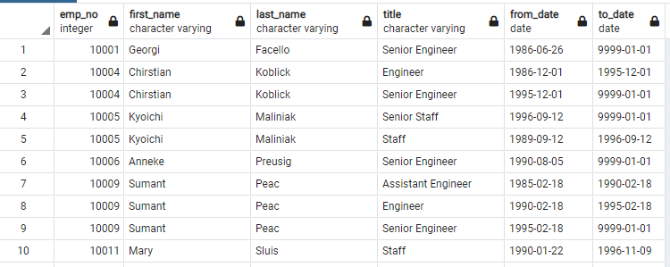
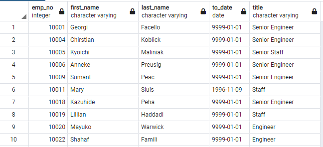
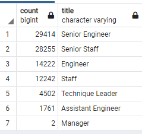
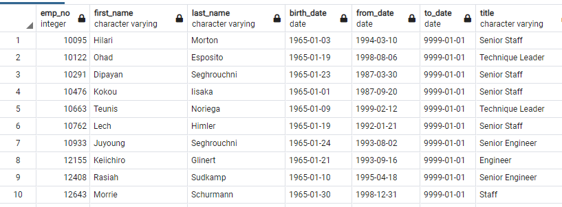
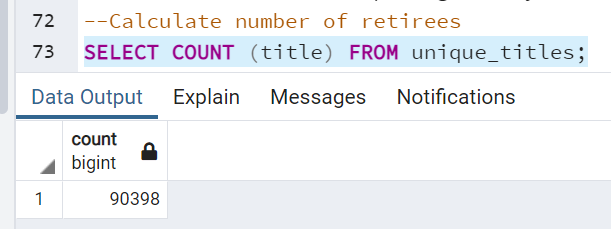
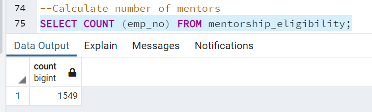

# Pewlett-Hackard-Analysis
## Overview
Pewlett-Hackard is a large company with several thousand employees, many of which are baby boomers set to retire rapidly.  The company would like to offer retirement packages to those who meet certain criteria and determine which positions to fill in the future as the upcoming retirements will cretae thousands of job openings.  
## Purpose
We have been asked to assist Bobby, an HR Analyst with employee research to predict who will be retiring in the next few years as well as how many positions will need to be filled by generating various employee lists using a SQL database.
## Resources
Data:  various .csv files 
Software(s):  quickdatabasediagrams.com, Postgresql v11.12, pgAdmin 4
## Results
1.  We identified all employees born between 1952 and 1955, with titles and service dates as potential retirees.
 
2. From the above, we retrieved current employees with their current titles using the DISTINCT ON statement.
 
3. Next, we determined the retirees by title and counted the number of positions that would be vacated using the GROUPBY and COUNT functions. 
 
4. Finally, we calculated the number of employees born in the year 1965 who would be eligible for a mentorship program using the DISTINCT ON statement.
 
## Summary
Approximately 64% of the silver tsunami hold senior positions.  Many of these retirees have held various positions through their tenure.  These are strong indicators that support a mentorship program to transfer knowledge from long-term employees to newer team members.

The number of retirees can be calculated using the COUNT function.
 

The number of mentors can be calculated using the COUNT function.
 
